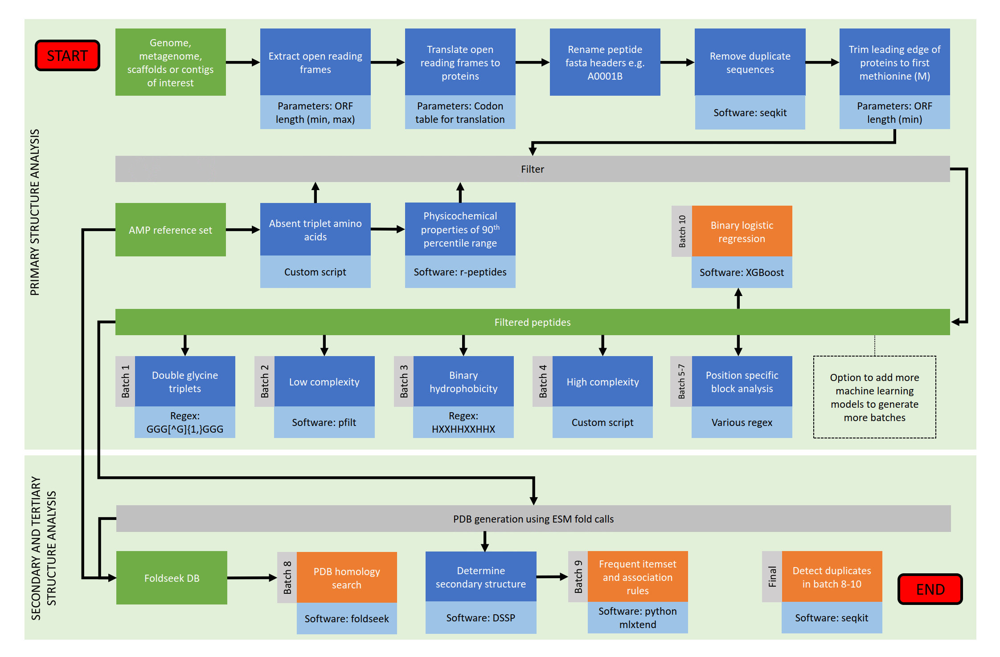

# DESCRIPTION
A software pipeline that takes as input a multi-fasta file containing any type of nucleotide sequences, extracts open reading frames (ORFs) from the nucleotide sequences, translates the ORFs to peptides, and through multiple filtering steps derives candidate antimicrobial peptides. NOTE: A single bacterial genome can be processed in less than five minutes but larger sequence sets can lead to memory and processor capacities being exceeded.

:zap: _"This wee script is a canny tool for rummaging through heaps of genetic code to root out what might just be the next big thing in fighting germs. Ye pop in a file crammed with DNA sequences and it gets to work sifting through to find the bits that could turn into proteins – those are your open reading frames, or ORFs. It then translates these ORFs into strings of amino acids to see if any might be shaped like the sort of peptides that have a knack for knocking out baddies like bacteria."_

# PIPELINE FLOW DIAGRAM

# INSTALLATION
The mamba package manager is needed to resolve installation of `libboost=1.73.0=h28710b8_12` for `dssp`:  
+ `conda install conda-forge::mamba`  

Then set up the conda environment as follow:  
+ `git clone https://github.com/Werner0/antimicrobial_peptides.git`
+ `cd ./antimicrobial_peptides/setup`  
+ `mamba env create -f requirements.yaml`
+ `conda activate candidates`
+ `bash configure_pfilt.sh`  

# USAGE
+ `bash end_to_end.sh [nucleotides.fasta|.fna]`
+ Example genomes are available in: `./source_files/genomes/`

# OUTPUT
+ Summary of FASTA batches and intermediary files: ./report_input_filename
  +  Batch 1: `GGG[^G]{1,}GGG` motif
  +  Batch 2: Low complexity candidates
  +  Batch 3: `HXXHHXXHHX` motif (after binary hydrophobicity conversion)
  +  Batch 4: High diversity candidates
  +  Batch 5: `[AGV][AG][EKR].*[ACK][ILV].*[GK].C` motif
  +  Batch 6: `YCN` motif
  +  Batch 7: `[M]..*[G].[G].[G]..*[R]..*[G]..*[P]..*[G]..*[RK]..*[EQ]..*` motif
  +  Batch 8: Tertiary peptide structure homologs
  +  Batch 9: Secondary peptide structure homologs
  +  Batch 10: Binary logistic regression candidates
+ Secondary structure analysis: ./output/secondary_structure_analysis.csv  
+ Tertiary structure analysis: ./output/tertiary_structure_analysis.txt  
+ Priority AMP candidates (empty file if none were detected): ./output/final.fasta

# LOGGING
+ Log written to ./log.txt  
+ For more verbose logging, uncomment `#set -x` on line 3 in ./end_to_end.sh

# DEMO

