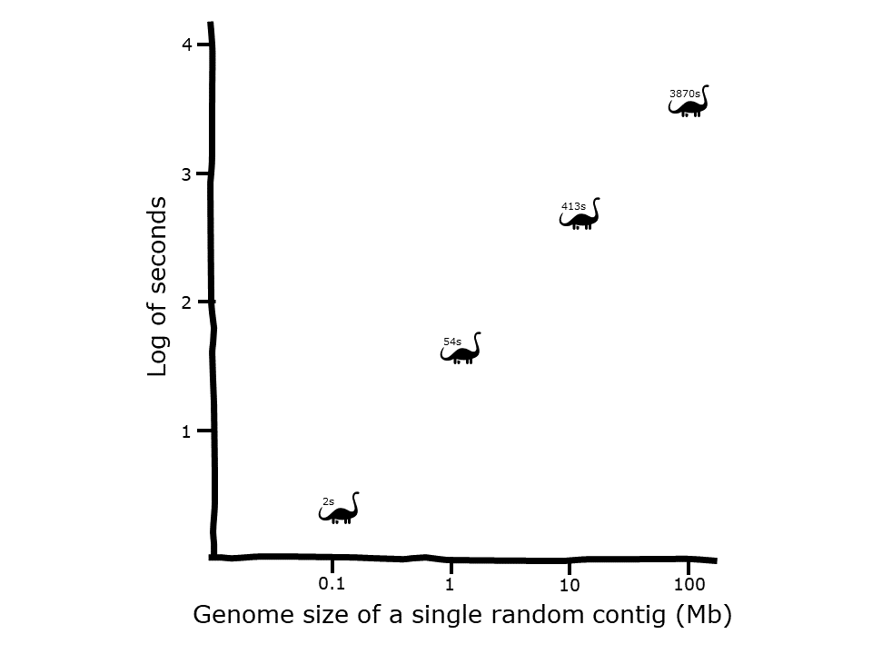

# DESCRIPTION
A software pipeline that takes as input a multi-fasta file containing any type of nucleotide sequences, extracts open reading frames (ORFs) from the nucleotide sequences, translates the ORFs to peptides, and through multiple filtering steps derives candidate antimicrobial peptides. A single bacterial genome can be processed in less than five minutes but larger sequence sets can lead to memory and processor capacities being exceeded (see [time complexity analysis](#pipeline-time-complexity-analysis)).

:zap: _"This wee script is a canny tool for rummaging through heaps of genetic code to root out what might just be the next big thing in fighting germs. Ye pop in a file crammed with DNA sequences and it gets to work sifting through to find the bits that could turn into proteins – those are your open reading frames, or ORFs. It then translates these ORFs into strings of amino acids to see if any might be shaped like the sort of peptides that have a knack for knocking out baddies like bacteria."_

# PIPELINE FLOW DIAGRAM


# INSTALLATION
The mamba package manager is needed to resolve installation of `libboost=1.73.0=h28710b8_12` for `dssp`:  

```
conda install conda-forge::mamba
```

Then set up the conda environment as follow:  

```
git clone https://github.com/Werner0/antimicrobial_peptides.git
cd ./antimicrobial_peptides/setup
mamba env create -f requirements.yaml
conda activate candidates
bash configure_pfilt.sh
```

# USAGE
The pipeline is designed for bacterial genome analysis but will take any nucleotide sequences as input. It will run using a sample nucleotide set consisting of two concatenated genomes (_Escherichia coli_ and _Sorangium cellulosum_) if no input is provided.

```
bash end_to_end.sh [nucleotides.fasta|.fna]
```

More example genomes are available in ./source_files/genomes/

# OUTPUT
+ HTML and CSV reports with summary statistics of batches and intermediary files:
  +  Batch 1: Candidates containing the `GGG[^G]{1,}GGG` motif. This motif is disproportionately present in the [APD reference set](https://aps.unmc.edu/).
  +  Batch 2: Low complexity candidates including those with coiled-coil, transmembrane and WD repeat signatures.
  +  Batch 3: Candidates containing the `HXXHHXXHHX` motif after binary hydrophobicity conversion, where the amino acid residues A, I, L, M, F, W & V are represented by H, the amino acid residues S, T, C, N, Q & Y are represented by P, and all others by X. This motif is the most frequent 10-mer at the k-peptide frequency peak of the APD reference set.
  +  Batch 4: High diversity candidates containing at least one of each of the twenty standard amino acid residues.
  +  Batch 5: Candidates containing the `[AGV][AG][EKR].*[ACK][ILV].*[GK].C` motif. This motif was obtained by MSA analysis of within peptide compositional frequencies of the APD reference set.
  +  Batch 6: Candidates containing the `YCN` motif. This motif was obtained by MSA analysis of across peptide compositional frequencies of the APD reference set.
  +  Batch 7: Candidates containing the `[M]..*[G].[G].[G]..*[R]..*[G]..*[P]..*[G]..*[RK]..*[EQ]..*` motif. This motif was obtained by MSA analysis of within peptide compositional frequencies of an NCBI IPG prokaryotic AMP set.
  +  Batch 8: Candidates with tertiary peptide structure homology to validated antimicrobial peptides in the APD reference set.
  +  Batch 9: Candidates with a similar itemset frequency as the APD reference set in terms of secondary structures including alpha helices (3-10 and pi), beta sheets (bridged and extended), hydrogen bond turns and loops.
  +  Batch 10: Candidates derived from binary logistic regression using [Moreau-Broto autocorrelation descriptors](https://github.com/nanxstats/protr/blob/master/R/desc-04-MoreauBroto.R) (normalized average hydrophobicity, average flexibility, polarizability, free energy in water, accessible surface area (as tripeptides), residue volume, steric hindrance, and relative mutability).
  +  File 1: Extracted ORFs.
  +  File 2: ORFs translated to peptides.
  +  File 3: Peptides with renamed headers.
  +  File 4: Deduplicated peptides.
  +  File 5: Peptides with at least one methionine residue.
  +  File 6: Peptides left-trimmed up to first methionine.
  +  File 7: Peptides with a minimum length of 10 residues.
  +  File 8: Peptides filtered for tripeptides that are not seen in the APD reference set.
  +  File 9: Peptides that meet the 95th percentile physicochemical distribution range of the APD reference set in terms of their counts of individual amino acid residue membership to the following classes: tiny, small, aliphatic, aromatic, non-polar, polar, charged, basic and acidic. 
  +  Combo Batch 1 to 7: Merge of batches 1 to 7 ("primary candidate set").
  +  Combo Batch 8 to 10: Merge of batches 8 to 10 ("secondary candidate set").
  +  Final: Priority AMP candidates ("tertiary candidate set").
+ Secondary structure analysis: ./output/secondary_structure_analysis.csv (for Batch 9).
+ Tertiary structure analysis: ./output/tertiary_structure_analysis.txt (for Batch 8).

# LOGGING
+ Log written to ./log.txt  
+ For more verbose logging, uncomment `#set -x` on line 3 in ./end_to_end.sh

# DEMO


# PIPELINE TIME COMPLEXITY ANALYSIS

